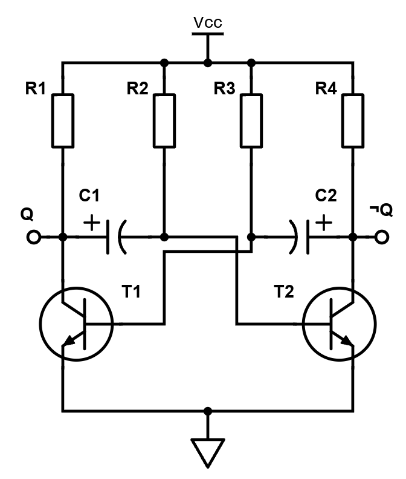

# Martin Lejsek
# 2025-26 Projekt
# Multivibrátor
Multivibrátor je elektronický obvod, který slouží ke generování elektrických pulzů, je to vastně astabilní klopný obvod.
Klopný obvod je takový obvod který se překlápí mezi dvěma stavy například mezi logickou 1 a 0. Klopné obvody jdou rozdělit na tři základní typy. Astabilní klopný obvod nemá žádný stabilní stav a neustále se překlápí z jedné polohy do druhé například blikač s LED diodami. Monostabilní obvod má jeden stabilní stav a když přijde impulz tak se překlopí do nestabilní polohy a po nějaké době se zase vrátí zpět, to je například schodišťový automat. Bistabilní klopný obvod má dva stabilní stavy, setrvává v nastaveném stavu a impulz ho uvede do druhého stavu, kde je do příchodu dalšího vnějšího impulzu. Bistabilní klopné obody se používájí například jako paměť.
## Schéma zapojení

## Princip zapojení
1. Na začátku se začnou nabíjet kondenzátory skrze kolektorové rezistory, protože mají nižší odpor než rezistory bázové.
2. Díky tolerancím a tomu, že dvě součástky nejsou nikdy úplně stejné, jeden tranzistor se otevře dříve.
3. Řekněme, že to bude třeba tranzistor Q1. Kladná elektroda kondenzátoru C1 je tedy nyní uzeměna.
4. To zapříčínní, že mezi bází a emitorem tranzistoru Q2 je nyní záporné napětí kondenzátoru C1. Tranzistor Q2 je tedy kompletně uzavřen.
5. V tomto stavu máme tedy na výstupu Q 0v, protože je spojen se zemí. Na výstupu ¬Q je napětí VCC.
6. Tranzistor Q1 je otevřený a Q2 zavřený, to znamená, že kondenzátor C1 se začne vybíjet/opačně nabíjet skrze bázový rezistor R2. Kondenzátor C2 se musí nabíjet nadále přes kolektorový rezistor R4. Bázové rezistory mají vyšší odpor, tudíž kondenzátoru C1 to bude trvat déle.
7. Jakmile se kondenzátor C1 vybije, přestane uzavírat tranzistor Q2. Až napětí na bázi tranzistoru Q2 dosáhne hodnoty potřebné pro otevření, tranzistor se otevře a uzemní tentokrát kladnou elektrodu kondenzátoru C2.
8. To způsobí záporné napětí na bázi tranzistoru Q1. Tranzistor Q1 je tedy uzavřen.
9. Na výstupu Q máme tedy napětí VCC a na výstupu ¬Q, který je spojen se zemí je 0V.
10. Kondenzátor C2 se tentokrát začne vybíjet a naopak C2 nabíjet a proces se opakuje.
